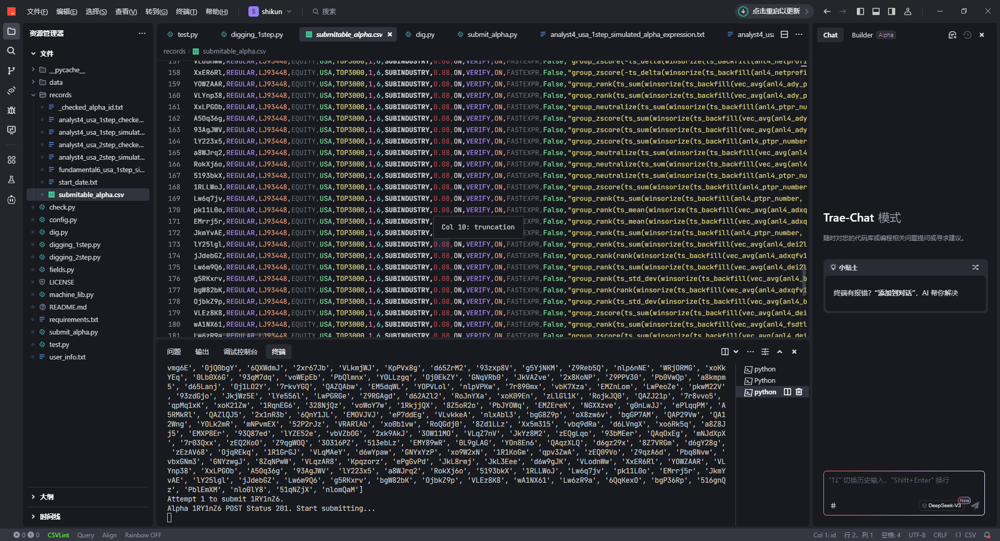

# WorldQuant Brain 因子挖掘自动化脚本

## 💡 项目简介

这是一个专为 WorldQuant Brain 平台设计的辅助工具，能够帮助用户**自动化发掘、验证和提交因子**，大幅提升因子构建效率与收益潜力。

WorldQuant Brain 是一个量化投资众包平台，个人可以通过构建有效因子参与全球量化策略开发，从中获得**美金奖励**，在家轻松赚钱。

---

## 💰 WorldQuant 能赚多少钱？

在 WorldQuant Brain 上，提交表现良好的因子可获得如下收益：

- ✅ **基础奖励**：每条通过审核的因子通常可获得 **$1~$10** 的一次性奖励；
- ✅ **累计收益**：优秀因子可持续产生被选中和复用的价值；
- ✅ **长期回报**：表现特别突出的研究员有机会签约成为兼职研究员（PRP），按因子表现分成，收入远高于普通任务型众包。

许多用户通过自动化工具和筛选策略，每月能赚到 **几十至数百美元不等**，适合有基础的量化、金融或编程爱好者参与。

---

## 🚀 工具亮点

- 🔍 **自动遍历参数空间**：批量组合回测函数、预处理函数与窗口长度
- ⚙️ **一键验证因子表现**：计算 fitness、Sharpe、correlation 等指标
- 📤 **支持自动提交**：兼容 WQB 提交接口（支持 token 登录）
- 📊 **结果筛选排序**：只保留高表现因子并导出到 CSV 或数据库
- 🧠 **可拓展性强**：脚本结构清晰，方便个性化因子模板接入

---
## 运行截图

## 📎 使用方式

📬 联系方式（获取工具脚本或定制服务）
如需获取脚本、使用说明或定制开发，请联系我：

💬 QQ：1840884735

💬 微信：LJJoner

欢迎加我交流如何系统化发掘 Alpha 因子、提升提交效率、稳定赚美金！

📌 注意事项
本脚本为个人开发，仅供学习研究用途；

使用前请确保已注册并了解 WorldQuant Brain 平台规则；

禁止用于恶意攻击或批量刷因子等违规操作。

🧠 关于 WorldQuant Brain
官网地址：https://www.worldquantbrain.com

WorldQuant Brain 是全球领先的量化研究平台，开放给全球研究者参与因子开发，共同驱动量化金融的进步。

